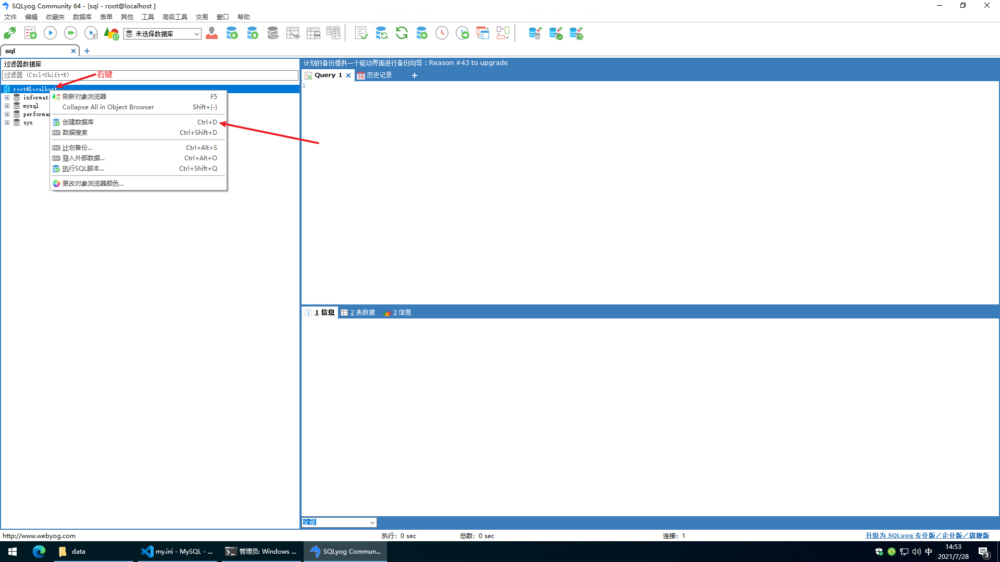
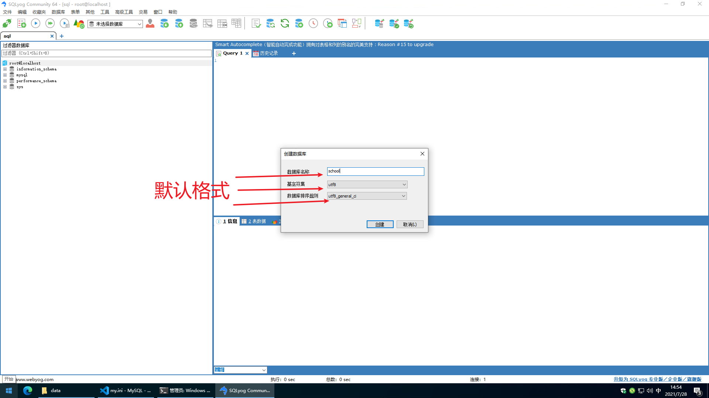
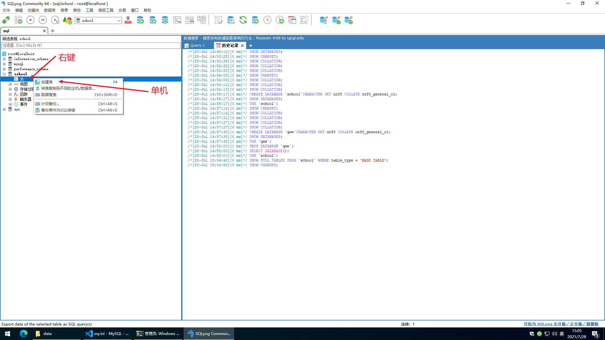
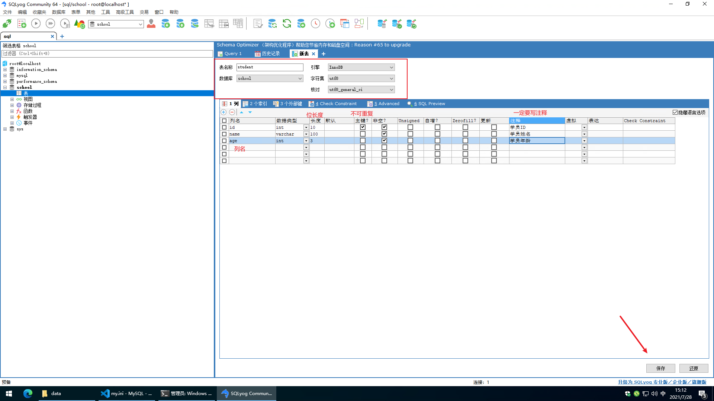
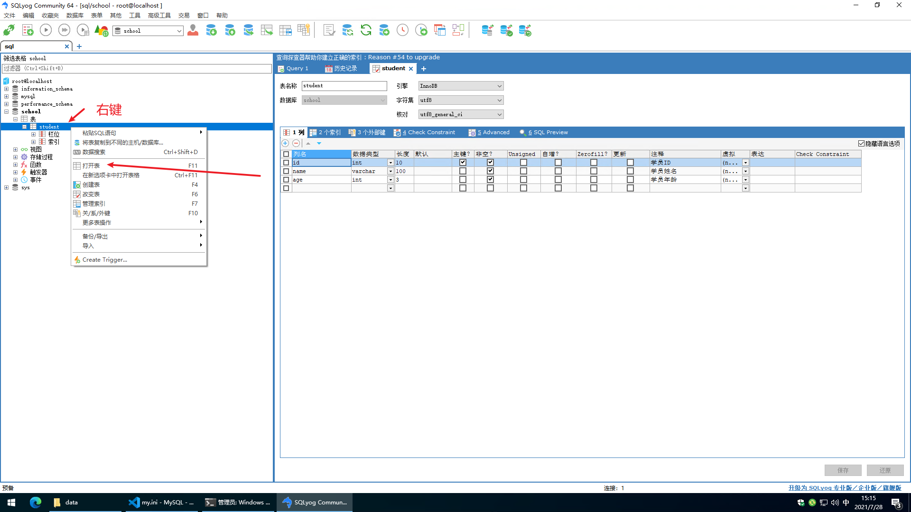
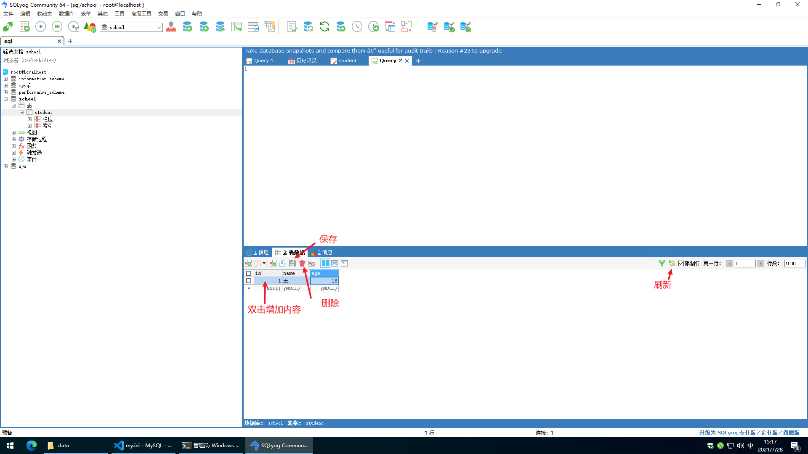
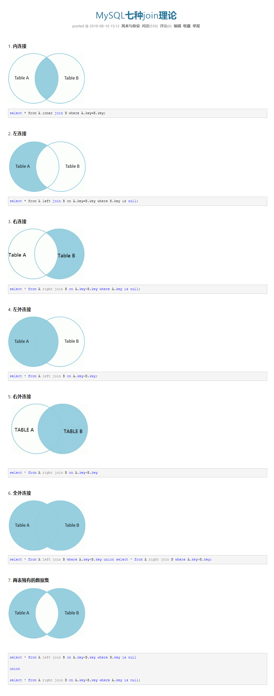

# MySQL学习记录

## 1、初识MySQL

JavaEE：企业级java开发 Web

前端（页面：展示，数据！）

后端 （连接点：连接数据库JDBC，链接前端（控制，控制视图跳转，给前端传递数据））

数据库 （存数据，TXT，Excel，word）

>只会写代码，学好数据库，基本混饭吃；
>
>操作系统，数据结构与算法！当一个不错的程序员！
>
>离散数学，数字电路，体系结构，编译原理，实战经验。高级程序员~优秀的程序员

### 1.1、为什么学习数据库

1. 岗位需求

2. 现在的世界，大数据时代~，得数据库者得天下。

3. 被迫需求：存数据 去IOE

4. **数据库是所有软件体系中最核心的存在 DBA**

### 1.2、什么是数据库

数据库（DB，DataBase）

概念：数据仓库，**软件**、安装在操作系统（windows,linux,mac...）之上！SQL，可以存储大量的数据。500万以内语句，超过需要优化。

作用：存储数据，管理数据

### 1.3 、数据库分类

**关系型数据库：** （SQL）

- MySQL，Oracle，Sql Server，DB2，SQLlite
- 通过表和表之间，行和列之间得关系进行数据的存储，  学员信息表，考勤表......

**非关系型数据库：** （No SQL）  Npt Only

- Redis，MongDB
- 非关系型数据库，对象存储，通过对象的自身属性来决定。

**DBMS（数据库管理系统）：**

- 数据库的管理软件，科学有效的管理我们的数据。维护和获取数据；

- MySQL，数据库管理系统！

### 1.4、MySQL简介

MySQL是一个**关系型数据库管理系统**，

前世：瑞典MySQL AB公司

今生：属于Orecle旗下产品

MySQL是最好的RDBMS（Relational Database Management System，关系数据库管理系统）应用软件之一。

开源的数据库软件~

体积小、速度快、总体成本比较低，招人成本比较低，所有人必须会。

中小型网站或者大型网站，集群。

官网：<https://www.mysql.com>

官网下载地址：<https://dev.mysql.com/downloads/mysql/>

MySQL5.7 64位下载地址：<https://dev.mysql.com/get/Downloads/MySQL-5.7/mysql-5.7.19-winx64.zip>

5.7稳、8.0新

安装建议：

1、尽量不要使用exe，注册表

2、尽可能使用压缩包安装~

### 1.5、安装MySQL

教程：

1、解压

2、把这个包放到自己的电脑环境目录下

3、添加环境变量

> 配置Path下的bin目录

4、在MySQL目录下新建mysql配置文件，编辑my.ini文件，注意替换路径位置。

my.ini内容：

```ini
[mysql]
# 设置mysql客户端默认字符集
default-character-set=utf8
[mysqld]
#设置3306端口
port = 3306
# 设置mysql的安装目录
basedir=C:\MySQL
# 设置mysql数据库的数据的存放目录
datadir=C:\MySQL\data
# 允许最大连接数
max_connections=200
# 服务端使用的字符集默认为8比特编码的latin1字符集
character-set-server=utf8
# 创建新表时将使用的默认存储引擎
default-storage-engine=INNODB
skip-grant-tables
```

5、启动管理员模式下的CMD，运行所有的命令，并将路径切换至mysql下的bin目录，然后输入`mysqld -install`（安装mysql）
   提示：**Service successfully installed.**为安装成功

6、然后输入`mysqld --initialize-insecure --user=mysql`初始化数据文件

7、然后再次启动MySQL（用`net start mysql`命令启动）然后用命令`mysql -u root -p`进入mysql管理页面（密码可为空）

8、进入界面后更改root密码

```sql
update mysql.user set authentication_string=password('123456') where user='root' and Host='localhost';
```

（最后输入`flush privileges;`刷新权限）

9、进入MySQL通过命令行【7、】（-p后边不要加空格），修改密码（sql语句后边一定要加分号！）

10、修改my.ini文件，删除最后一句skip-grant-tables

11、重启mysql即可正常使用

`net stop mysql`         关闭

`net start mysql`        启动

11、连上测试出现以下结果就装好了

### 1.6、安装SQLyog

1. [Downloads · webyog/sqlyog-community Wiki (github.com)](https://github.com/webyog/sqlyog-community/wiki/Downloads)

2. 下载完毕安装

3. 打开链接数据库

4. 新建数据库
   
   默认采用
   

5. 新建一张表 student
   > 字段： id、name、age

   
   

6. 查看表
   

7. 修改表
   

### 1.7、连接数据库

命令行连接

```sql
-------------------------
--SQL命令不区分大小写，但是引号内数据区分大小写
--所有的语句都要分号结尾;
--退出MySQL命令行，退出可以不加;
exit
quit
--这是一条单行注释
--命令行中可以用#来注释，代表--，不建议使用
/*
   这是一条多行注释
   1
   2
   3
*/
-------------------------


--user   一般为root，看自己的设置
--passwd 可以在此处填密码（注意不要有空格），也可以回车后在输入
mysql -u user -ppasswd

--修改用户密码
update mysql.user set authentication_string=password('密码') where user='用户' and Host='z';

--刷新权限
flush privileges;

--查询所有数据库
SHOW DATABASES;

--切换数据库，无论带不带着重号都可以，特殊字符
USE `数据库的名字`;
Database changed  --数据库切换成功

--查看当前数据库下的表
show tables;

--查看这个表的信息
describe 表名;    --命令可以简写为desc

--创建一个数据库
create database 数据库名;
Query OK, 1 row affected (0.00 sec)    --成功后显示
```

**数据库 XXX 语言.**
> 本质就是  CRUD<<--增删改查

DDL 定义

DML 操作

DQL 查询

DCL 控制

## 2、操作数据库

操作数据库>操作数据库中的表>操作数据库中的表的数据

MySQL关键字不区分大小写

### 2.1、操作数据库

> []中间的内容为可选输入
>
> 输入命令时不要带[]

1. 创建数据库

   ```sql
   --创建一个数据库，重名发出警告
   create database [if not exists] 数据库名;  --[if not exists]表示是判断是否出现重名，有发出警告而不是报错
   ```

2. 删除数据库

   ```sql
   --删除数据库命令
   drop database [if exists] 数据库名;       --[if exists]表示判断是否存在有该数据库，有则删除，没有警告
   ```

3. 使用数据库

   ```sql
   --如果你的表名或者字段看名是一个特殊字符就要带``
   use `名`

   --查询表内的列，列名有时候会是user这种特殊字段就要加``
   select `列名` from 表名;
   ```

4. 查看数据库

   ```sql
   --查看此数据库，databases表示所有数据库
   show 数据库名;
   ```

### 2.2、数据库的列类型

- 数字
  - tinyint    十分小的数据    1个字节
  - smallint   比较小的数据    2个字节
  - mediumint  一般小的数据    3个字节
  - **int      标准大的整数    4个字节**    常用的
  > 申请的位数是几位十进制，申请几位无所谓，一样可以超出大小，没达到足够的位数前边补零（需要勾选zerofill）

  - bigint     比较大的数据    8个字节
  - float      单精度浮点数    4个字节
  - double     双精度浮点数    8个字节
  - decimal    字符串型高精度存储单位    扩展大小    金融常用

- 字符串
  - char     固定字符串        0~255个字
  > 一个字节可以存一个字，申请几个写几个，写不够补空格

  - **varchar  可变字符串  0~65535个字**    常用
  > 申请几位写不到留空，需要预留长度标记，小于255占1位，大于255占两位

  - tintext  微型文本    255个字
  - text     中型文本    65535个字

- 时间日期
- date      YYYY-MM-DD    日期
- time      HH：mm：ss    时间
- datetime  YYYY-MM-DD  HH：mm：ss    日期时间    最常用
- timestamt 时间戳    1970.1.1到现在的毫秒
- year    年份
- NULL
  - 没有值
  - 注意！不要使用NULL进行运算，结果为NULL

### 2.3、数据库的字段属性

Unsigned：

- 无符号的整数
- 表示该列不能声明为附属

zerofill:

- 0填充的
- 不足的位数使用0来填充

自增(autoincrement)：

- 通常理解为自增，自动在上一条的记录上+1（默认）
- 通常用来设置唯一的主键~ index，必须是整数类型
- 可以自定义设计主键自增的起始值和步长

非空（not null）：

- 假如设置了非空，如果不给它赋值，就会报错
- 如果不设置，不填写东西，默认为NULL

默认：

- 设置默认的值
- 如果设置了默认，不给予内容，则会启用默认的值

扩展：阿里巴巴规定

> 每一个表，都必须有以下5个列名！未来做项目用的，表示一个记录存在的意义
>
>
>
> id 主键
>
> ‘version’    乐观锁
>
> is_delete   伪删除
>
> gmt_create    创建时间
>
> gmt_update   修改时间

### 2.4、创建数据库表

```sql
-- 目标:创建一个school数据库
-- 创建学生表(列，字段) 使用SQL创建
-- 学号int 登录密码varchar(20) 姓名，性别varchar(2) 出生日期(datatime) 家庭住址，email
-- 注意使用英文 括号()和逗号, 表的名称和字段尽量使用``括起来
-- AUTO_ INCREMENT 是自增
-- 字符串使用 单引号括起来!
-- 所有的语句后面加 ，(英文的)，最后一个不用加
-- PRIMARY KEY主键，一般一个表只有一个唯一的主键!
CREATE TABLE IF NOT EXISTS `student`(
   `id` INT(4) NOT NULL AUTO_INCREMENT COMMENT '学号'，
   `name` VARCHAR(30) NOT NULL DEFAULT '匿名' COMMENT '姓名'，
   `pwd` VARCHAR(20) NOT NULL DEFAULT '123456' COMMENT '密码'，
   `sex` VARCHAR(2) NOT NULL DEFAULT '女' COMMENT '性别'，
   `birthday` DATETIME DEFAULT NULL COMMENT '出生日期',
   `address` VARCHAR(100) DEFAULT NULL COMMENT '家庭住址',
    `email` VARCHAR(50) DEFAULT NULL COMMENT '邮箱'，
    PRIMARY KEY(`id`)
)ENGINE=INNODB DEFAULT CHARSET=utf8
```

表创建格式

```sql
CREATE TABLE IF NOT EXISTS `表名`(
   `字段` 列类型 [属性] [索引] [注释],
   `字段` 列类型 [属性] [索引] [注释],
   ......
   `字段` 列类型 [属性] [索引] [注释],
   `字段` 列类型 [属性] [索引] [注释]
)[表类型] [字符集设置] [注释]
```

常用命令

```sql
SHOW CREATE DATABASE 数据库名  -- 查看本数据库的创建语句
SHOW CREATE TABLE 表名  -- 查看本表的创建语句
DESC 表名  -- 显示表的结构
```

### 2.5、数据表的类型

关于数据库引擎

   > INNODB  默认使用
   >
   > MYSIAM  早些年使用

|              | MYISAM | INNODB               |
| ------------ | ------ | -------------------- |
| 事务支持     | 不支持 | 支持                 |
| 数据行锁定   | 不支持 | 支持                 |
| 外键约束     | 不支持 | 支持                 |
| 全文索引     | 支持   | 不支持               |
| 表空间的大小 | 较小   | 较大，约MYISAM的两倍 |

常规使用操作

- MYISAM 节约空间，速度快
- INNODB 安全性高，事务的处理，多表多用户操作

> 在物理空间存在的位置

所有的数据库文件都存在data目录下

本质还是文件存储！

MySQL引擎在物理文件上的区别

- INNODB 在数据库表中只有一个*.frm文件，以及上级目录下的ibdata1文件
- MYISAM对应文件
  - *.frm  - 表结构的定义文件
  - *.MYD  - 数据文件（data）
  - *.MYI  - 索引文件（index）

> 设置数据库表的字符集编码

```sql
CHARSET=utf8
```

不设置的话，会是MySQL默认的字符集编码（Latin1，不支持中文）

MySQL的默认编码是Latin1，不支持中文

**第二种修改方法：**

在my.ini中配置默认的编码

```ini
character-set-server=utf8
```

### 2.6、修改删除表

> 修改

```sql
-- 修改表名
ALTER TABLE 原表名 RENAME As 新表名
-- 增加表的字段
ALTER TABLE 原表名 ADD [字段名] [属性。。]
-- 修改表的字段（重命名，修改约束！）
ALTER TABLE 表名 MODIFY 列名 新列属性  -- 修改约束
ALTER TABLE 表名 CHANGE 原列名 新列名 新列属性  -- 字段修改
-- 删除表的字段
ALTER TABLE 表名 DROP 列名
```

> 删除

```sql
-- 删除表(如果存在在删除)
DROP TABLE IF EXISTS 表名
```

<!--所有的创建和删除操作尽量加上判断，以免报错-->

注意点：

- `` 字段名，使用这个包裹
- 注释 -- /**/
- SQL关键字大小写不敏感
- 所有的符号用英文

## 3、MySQL数据管理

### 3.1、外键

外键从表只可以引用主表的主键

不推荐使用外键，尽量避免使用，使用实现在应用层实现

> 方式一、创建表的时候，增加约束（先删除从表（连接关系），在删除主表才可有）

```sql
-- 创建被链接的表（主表）
CREATA TABLE `表名`（
   `被引用的字段`,
   ...,
   -- 设置主键
   PRIMARY KEY (`被引用的字段`)
)ENGINE=INNODB DEFAULT CHARSET=utf8


-- 创建链接表（从表）
CREATA TABLE `表名`（
   `id` INT(4) NOT NULL AUTO_INCREMENT COMMENT '号',
   `引用的主表字段名字段`,
   ...,
   -- 设置主键
   PRIMARY KEY(`id`),

   -- 设置外键
   -- key 是数据库的物理结构，它包含两层意义和作用，
   -- 一是约束（偏重于约束和规范数据库的结构完整性），
   -- 二是索引（辅助查询用的）。
   KEY `约束名` (`引用的主表字段名字段`), -- 本行影响不大
   -- CONSTRAINT `约束名`  给这个约束起个名字
   -- 建立外键的前提：本表的列必须与外键类型相同(外键必须是外表主键)。
   -- FOREIGN KEY (`引用的主表字段名字段`) 设置外键
   -- REFERENCES `主表表名`(`主表被引用字段`)  设置引用
   CONSTRAINT `约束名` FOREIGN KEY (`引用的主表字段名字段`) REFERENCES `主表表名`(`主表被引用字段`)
）ENGINE=INNODB DEFAULT CHARSET=utf8
```

> 方式二、创建表之后在添加外键约束

```sql
-- 创建被链接的表（主表）
CREATA TABLE `表名`（
   `被引用的字段`,
   ...,
   -- 设置主键
   PRIMARY KEY (`被引用的字段`)
)ENGINE=INNODB DEFAULT CHARSET=utf8

-- 创建链接表（从表）
CREATA TABLE `表名`（
   `id` INT(4) NOT NULL AUTO_INCREMENT COMMENT '号',
   `引用的主表字段名字段`,
   ...,
   -- 设置主键
   PRIMARY KEY(`id`)
）ENGINE=INNODB DEFAULT CHARSET=utf8

-- ALTER TABLE `表`  进入修改表
ALTER TABLE `从表`
-- ADD 增加 连接语句
ADD CONSTRAINT `约束名` FOREIGN KEY(`引用的主表字段名字段`) REFERENCES `主表表名`(`主表被引用字段`);
```

以上操作都是物理外键，数据库级别的外键，不建议使用！（避免数据库过多造成困扰）

**最佳实现：**

- 数据库就是单纯的表，只用来存数据，只有行（数据）和列（字段）
- 想使用多张表的数据，使用程序实现

### 3.2、DML语言

**数据库意义**：数据存储，数据管理

DML语言：数据操作语言

- Insert
- update
- dalete

### 3.3、添加

> INSERT

 ```sql
 -- 插入语句（添加）
 -- 字段与值对应
 INSERT INTO `表名` （`某字段`,`某字段`,`某字段`） VALUES('值'),('值'),('值')
 -- 自增字段可以省略
 -- 不写表的字段，直接给值他会挨个对应（容易出错）
 INSERT INTO `表名` VALUES(`值`)
 -- 一般写插入语句，一定要数据可字段对应

 -- 插入多个字段
 INSERT INTO `表名` (`字段名`) VALUES('值'),('值'),('值')  -- 对该字段插入三行
 ```

语法：`INSERT INTO`表名`（`某字段`,`某字段`,`某字段`） VALUES('值'),('值'),('值')`

注意事项：

1. 字段和字段之间使用英语逗号隔开
2. 字段是可以省略的，但是后边的值必须要一一对应，不能省略
3. 可以同时插入多条数据，VALUES后面的值，需要使用英文逗号隔开

### 3.4、修改

> UPDATE

```sql
-- 修改学员的名字，带条件
-- WHERE `判断的关键字` = '某个值'  判断语句
UPDATE `表名` SET `修改的字段`='修改后的结果' WHERE `判断的关键字` = '某个值';  -- 修改`判断的关键字`为'某个值'的`修改的字段`为'修改后的结果'
-- 无条件就会修改 被修改的关键字 的所有行为 '修改后的结果'

-- 修改多个字段逗号隔开
UPDATE `表名` SET `修改的字段1`='修改后的结果',`修改的字段2`='修改后的结果' WHERE `判断的关键字` = '某个值';
```

条件判断运算符：

| 操作符  | 含义     | 范围                       | 结果       |
| ------- | -------- | -------------------------- | ---------- |
| =       | 等于     | 相等值                     | bool值     |
| <>或!=  | 不等于   | 不等值                     | bool值     |
| >       | 大于     | 大于N的                    | 范围       |
| <       | 小于     | 小于N的                    | 范围       |
| >=      | 大于等于 | 大于等于N的                | 范围       |
| <=      | 小于等于 | 小于等于N的                | 范围       |
| BETWEEN | 范围值   | BETWEEN n AND x            | n到x的范围 |
| AND     | &&与     | 多条件链接全返回为真的     | bool值     |
| OR      | \|\|或   | 多条件链接有一个返回为真的 | bool值     |

注意：

- colnum_name 是数据可得列，尽量带上``符号
- 条件，筛选的条件，如果没有指定，则会修改所有的列
- value，是一个具体的值，也可以是一个变量

### 3.5、删除

> delete

```sql
-- 删除数据
-- 删表行内容
DELETE FROM `表名`  -- 避免使用这个
-- 删除指定数据
DELETE FROM `表名`  WHERE 条件判断
```

> TRUNCATE
>
> 作用：完全情况清空一个数据库表，表的结构和索引约束不会变

```sql
-- 清空表
TRUNCATE `表名`
```

> delete和truncate的区别

相同点：都能删除数据，都不会删除表结构

不同：

- TRUNCATE 重新设置 自增列 计数器会归零
- TRUNCATE 不会影响事务

```sql
-- TRUNCATE和DELETE的区别
DELETE FROM '表名'  -- 不会影响自增
TRUNCATE '表名'  -- 自增归零
```

DELETE删除后重启数据库

- InnoDB 自增列会重1开始（因为他的自增量存在内存中）
- MyISAM 继续从上一个自增量开始（因为他的自增量存在硬盘文件中）

## 4、DQL查询数据

### 4.1、DQL

> Data Query Language：数据查询语言

- 所有的查询操作都用它 Select
- 简单的查询，复杂的查询它都能做
- 数据库中最核心的语言，最重要的语句
- 使用频率最高的语句

### 4.2、指定查询字段

```sql
-- 查询所有
SELECT `字段`,`字段` FROM `表名`  -- 查询该表的字段 * 代表所有，可以一次查多个字段

-- AS 起别名 字段和表都可以
-- AS 在有时可以省略，直接 空格 和 别名 即可
SELECT `字段` AS 别名,`字段` AS 别名 FROM `表名` -- 显示出来的列头会变为别名

-- 函数 CONCAT
SELECT CONCAT('追加名',字段) AS 别名 FROM 表名  -- 查询到的字段前加上追加名输出
```

> 去重 distinct

```sql
-- 发现重复数据，去重
-- 作用：去除SELECT查询出来的结果中重复的数据，只显示一条
SELECT DISTINCT `字段` FROM 表    -- 去除重复内容输出
```

> 数据库的列（表达式）

```sql
-- 查询系统的版本
SELECT VERSION()    -- 函数

-- 输出计算结果
SELECT n+x-y*z/q    -- 表达式

-- 查询自增的步长
SELECT @@auto_increment_increment    -- 变量

-- 可以对结果做修改
SELECT `type`+n FROM table  -- 只是对临时显示修改，不会对文件数据修改
```

> 数据库中的表达式：文本值，列，NULL，函数，计算表达式，系统变量。。。
>
> SELECT 表达式 FROM 表

### 4.3、where条件子句

作用：检索数据中符合条件的值

搜索的条件由一个或者多个表达式组成，返回结果为布尔值

> 逻辑运算符

| 运算符   | 语法             | 描述   |
| -------- | ---------------- | ------ |
| and、&&  | a AND b、a && b  | 逻辑与 |
| or、\|\| | a OR b、a \|\| b | 逻辑或 |
| Not、！  | NOT a、！a       | 逻辑非 |

尽量使用英文字母

> 模糊查询：比较运算符

| 运算符      | 语法              | 描述                                |
| ----------- | ----------------- | ----------------------------------- |
| IS NULL     | a IS NULL         | 如果为空结果为真                    |
| IS NOT NULL | a IS NOT NULL     | 如果为非空结果为真                  |
| BETWEEN     | a BETWEEN b AND c | 若a在b和c之间，为真                 |
| Like        | a Like b          | SQL匹配，如果a匹配b，结果为真       |
| IN          | a IN(a1,a2,a3...) | 假设a在括号内的值中有一个相同，为真 |

```sql
-- Like用法
-- LIKE结合 %（代表任意值）_（代表一个字符）
SELECT `type` FROM `TABLE` WHERE `type` LIKE 'n%';    -- n%为n****。。。    n_为n*

-- IN用法
SELECT `type` FROM `TABLE` WHERE `type` IN (n,n,n);    -- 查询type内有没有与n相匹配的，输出相匹配的

-- NULL or NOT NULL的用法
SELECT `type` FROM `TABLE` WHERE `type`='' OR `type` IS NULL;    -- 查询为空的
SELECT `type` FROM `TABLE` WHERE `type` IS NOT NULL;    -- 查询不为空的
```

### 4.4、联表查询

> JOIN 对比



```sql
-- 在多表查询时，ON和where都表示筛选条件，on先执行，where后执行。
-- 区别：
-- 外连接时，on条件是在生成临时表时使用的条件，它不管on中的条件是否为真，都会返回左边表中的记录。而where条件是在临时表生成好后，再对临时表进行过滤的条件。
-- JOIN（链接的表） on （判断条件）连接查询
-- WHERE 等值查询

-- 联表查询 join
-- 思路:
-- 1、分析需求，分析查询的字段来自那些表（连接查询）
-- 2、确定使用哪种链接查询
-- 确定交叉点（这两个表中那个数据是相同的）
-- 判断条件：`表1`中的`字段n` = `表2`中的`字段n`

-- INNER JOIN
SELECT `表1.字段1`,`字段2`,`字段3`,`字段4`    -- `表1.字段1`的意思为，两表内有相同的字段时，指定采用那个表
FROM `表1`        -- 链接表1
INNER JOIN `表2`  -- 链接表2中的相同点
ON `表1.字段1` = `表2.字段1`;  -- 判断两字段是否相等，但是不影响执行，换为 WHERE 如不同，影响执行
-- WHERE
SELECT `表1.字段1`,`字段2`,`字段3`,`字段4`    -- `表1.字段1`的意思为，两表内有相同的字段时，指定采用那个表
FROM `表1`        -- 链接表1
INNER JOIN `表2`  -- 链接表2中的相同点
WHERE `表1.字段1` = `表2.字段1`;    -- 发生两字段行内容不相等时不输出该行

-- RIGHT JOIN
-- RIGHT JOIN 关键字从右表（表2）返回所有的行，即使左表（表1）中没有匹配。如果左表中没有匹配，则结果为 NULL。
SELECT `表1.字段1`,`字段2`,`字段3`,`字段4`
FROM `表1`
RIGHT JOIN `表2`
ON `表1.字段1` = `表2.字段1`;

-- LEFT JOIN
-- LEFT JOIN 关键字从左表（表1）返回所有的行，即使右表（表2）中没有匹配。如果右表中没有匹配，则结果为 NULL。
SELECT `表1.字段1`,`字段2`,`字段3`,`字段4`
FROM `表1`
LEFT JOIN `表2`
ON `表1.字段1` = `表2.字段1`;
```

| 操作       | 描述                                         |
| ---------- | -------------------------------------------- |
| INNER JOIN | 如果表中至少有一个匹配，就返回行             |
| LEFT JOIN  | 即使右表中没有匹配，也会从左表中返回所有的值 |
| RIGHT JOIN | 即使左表中没有匹配，也会从右表中返回所有的值 |

```sql
-- 测试

-- ON 套 WHERE
SELECT `表1.字段1`,`字段2`,`字段3`,`字段4`
FROM `表1`
LEFT JOIN `表2`
ON `表1.字段1` = `表2.字段1`
WHERE `字段3` IS NULL;    -- 字段3为空时输出该行

-- 连续查询
SELECT `表1.字段1`,`字段2`,`字段3`,`字段4`
FROM `表1`
RIGHT JOIN `表2`
ON `表1.字段1` = `表2.字段1`  -- 输出字段1
INNER JOIN `表3`			    -- 导入表3中与表2相同的字段
ON `表3.字段3` = `表2.字段3`  -- 字段3输出，表3的字段3

-- 我要查询哪些数据 SELECT 。。。
-- 从哪几个表中查FROM 表 XXX JOIN 链接的表 ON 交叉条件
-- 假设存在一种多张表查询，慢慢来，先查询两张表，然后慢慢增加

-- FROM a LEFT JOIN b
-- FROM a RIGHT JOIN b
```

> 自连接

自己的表和自己的表接，核心：一张表拆为两张一样的表

```sql
SELECT a.`名字段` AS '父栏目',b.`名字段` AS '子栏目'
FROM `表` AS a, `表` AS b
WHERE a.`父表id` = b.`父表所在id`
```

### 4.5、分页和排序

> 排序

```sql
-- 排序 ： 升序ASC，降序DESC
-- ORDER BY 字段排序
SELECT ****;
ORDER BY 受判断的当前表的字段位置 选择升序OR降序;
```

> 分页

```sql
-- limit 索引（从0开始）,显示数量
limit 从第N个开始计算（0为起始）,显示数量;
```

### 4.6、子查询

原：where(这个值是固定的)

子查询：

> where(这个值是计算出来的)
>
> 在where语句中嵌套一个子查询语句
>
> where(select * from)

## 5、MySQL函数

[[5.7官方文档](https://dev.mysql.com/doc/refman/5.7/en/built-in-function-reference.html)]

### 5.1、常用函数

```sql
-- 查官网文档
-- https://dev.mysql.com/doc/refman/5.7/en/built-in-function-reference.html
```

### 5.2、聚合函数

```sql
```

